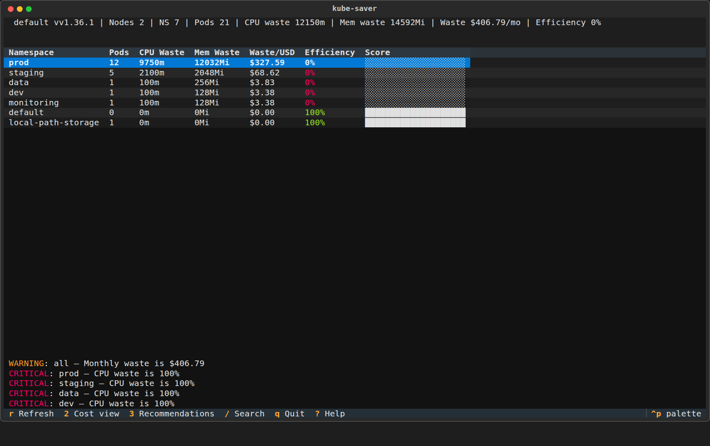
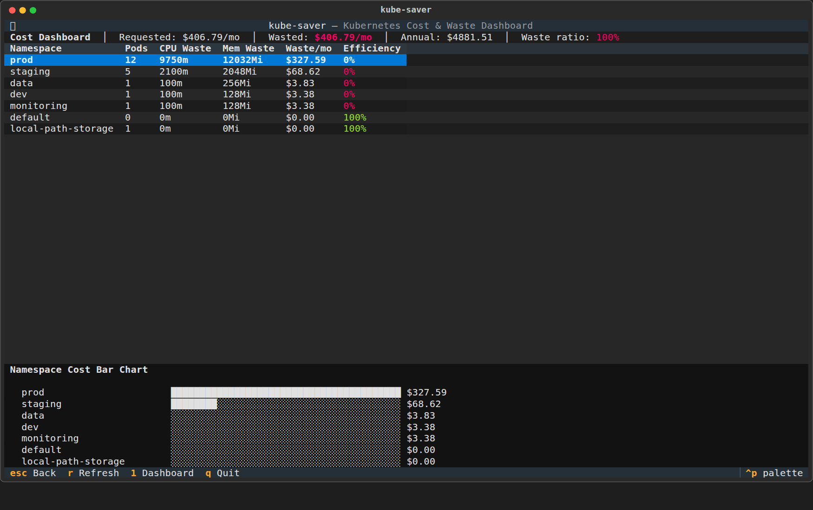
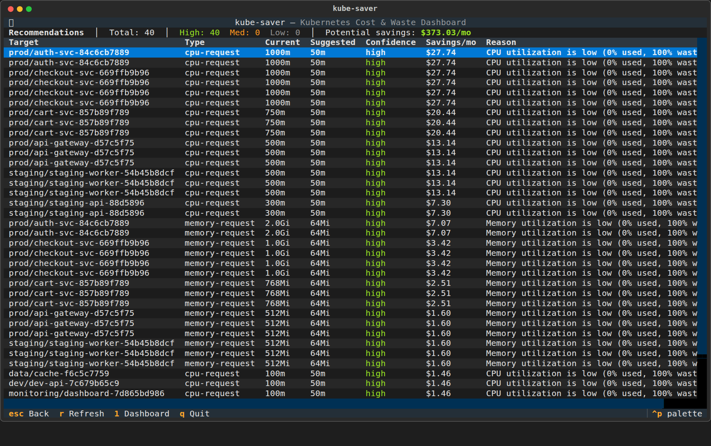

# kube-saver

> **See exactly where your Kubernetes money goes — then fix it.**

kube-saver is a terminal tool that turns invisible cluster waste into visible dollar amounts, works entirely offline with just your kubeconfig, and generates self-contained reports you can share with anyone.

[](LICENSE)
[](https://www.python.org/downloads/)
[](https://kubernetes.io/)
[](https://github.com/pooyanazad/kube-saver)

```
┌─ kube-saver ─────────────────────────────────────────────────────┐
│ Cluster: prod-us-east-1  │ Provider: AWS  │ CPU: 124/400 cores   │
├──────────────────────────────────────────────────────────────────┤
│ Total Monthly Waste: $2,847  │  Efficiency: 42%  │  Pods: 312    │
├──────────────────────────────────────────────────────────────────┤
│ Namespace          CPU Waste    Mem Waste    Monthly $   Score   │
│ default            45.2 cores   98 GB        $1,247     ██░░ 34  │
│ payments           12.8 cores   34 GB        $    642   ███░ 51  │
│ analytics           8.1 cores   22 GB        $    418   ███░ 58  │
│ staging             3.2 cores    9 GB        $    312   ████ 72  │
│ monitoring          0.8 cores    2 GB        $     89   █████ 91 │
└──────────────────────────────────────────────────────────────────┘
```

## What is kube-saver?

**kube-saver is a fast, offline, self-contained Kubernetes cost visibility tool that turns cluster waste into dollar amounts you can act on in one command.**

It gives platform engineers, SREs, and DevOps teams the three things most cost tools miss:

- A real dollar number per namespace, workload, and pod — not just CPU millicores
- A tool that runs from a kubeconfig alone, with no account, no token, and no hosted backend
- Self-contained outputs (HTML report, PR plan, notification files) that work anywhere, even offline

If you can run `kubectl`, you can run kube-saver. The README, TUI, reports, and CI outputs are designed to be useful within five minutes of install — even if you have never used the tool before.

### Who is this for?

kube-saver is built for:

- **Platform engineers** who manage Kubernetes clusters and want clear visibility into where compute budget is being wasted
- **DevOps teams** who need to communicate infrastructure cost to engineering stakeholders without relying on cloud dashboards alone
- **SREs and operators** who want a self-contained, scriptable tool that works in CI and local environments without external services
- **Startup teams** running Kubernetes on a budget who want to cut waste before it becomes a problem
- **Solo cluster operators** who want one fast tool to understand and report on cluster cost without complexity

### Who this is NOT for?

kube-saver is not a substitute for:

- Full cloud cost management platforms (it does not ingest billing data)
- Automated rightsizing engines that apply changes directly
- Tools that require a hosted service or account to function

## Three problems kube-saver solves

These are the hard problems kube-saver addresses better than existing alternatives.

### 1. You cannot fix what you cannot see in dollars

Most Kubernetes tools report waste in CPU millicores and memory bytes. That does not help you prioritize. kube-saver converts every waste signal into **actual monthly cost**, so you know which namespace to fix first.

### 2. Cost visibility should not require an account, a cloud backend, or a SaaS signup

Existing cloud dashboards and cost tools often depend on external accounts, API tokens, or hosted backends. kube-saver works **entirely offline** with just your kubeconfig. No accounts, no tokens, no external service, no data leaves your machine.

### 3. Reports should be self-contained and shareable without dependencies

When you generate an HTML report, notification, or PR plan, it should work for anyone — in a browser, in CI, or in an email — with no CDN, no hosted assets, and no webhook endpoints. kube-saver outputs are **fully self-contained by design**.

## Why kube-saver is Different

kube-saver was built around those three problems from the start.

- **Shows dollar waste, not just resource waste** — monthly and yearly cost estimates are built into every view
- **Works with just a kubeconfig** — no cloud account, no hosted service, no external dependency
- **Self-contained outputs** — HTML reports, PR plans, notifications, and JSON are fully portable
- **k9s-style interactive TUI** — navigate clusters, namespaces, and pods with the keyboard
- **Runtime source awareness** — uses eBPF when available, otherwise falls back to metrics-server or estimated data
- **Smart recommendations** — suggests optimal resource requests and limits
- **Safety guardrails** — avoids unsafe recommendations by design

**Try it now on any cluster you have kubeconfig access to. You will have a real cost report in five minutes, and you do not need to install anything else, create any account, or open any port.**

## Quick proof of concept

If you have access to any Kubernetes cluster, you can see kube-saver in action right now:

```bash
kube-saver report -o kube-saver-report.html
open kube-saver-report.html    # or: xdg-open on Linux
```

This generates a self-contained HTML report you can open in any browser — no server, no API key, no internet required.

## Status

**Production-quality release.**

Implemented:
- Phase 1 foundation
- Phase 2 analyzers and recommendations
- Phase 3 TUI
- Phase 4 runtime collector fallback chain
- Phase 5 self-contained exporters and integrations
- Phase 6 test suite, server mode, and CI setup

Key result: kube-saver now works without depending on maintainer-owned external services.
Notifications are written to local Markdown files, PR output is generated as local review/apply artifacts, HTML reports are fully self-contained, and release artifacts are published through GitHub Actions only.

## Current Features

- Interactive TUI dashboard via `kube-saver` or `python -m kube_saver.cli`
- Click CLI subcommands: `tui`, `report`, `pr-plan`, `notify`, `serve`, `version`
- Cluster, namespace, and pod waste analysis
- Monthly and yearly cost estimation
- Multi-currency display
- Custom CPU and memory pricing
- Runtime metric fallback chain:
  - eBPF
  - metrics-server
  - estimated data
- YAML exporter
- Helm values exporter
- PR plan generator that writes local review/apply files
- Markdown notification output (daily summaries and spike alerts)
- Prometheus metrics formatter
- Self-contained HTML report generator with inline CSS charts
- JSON output builder
- Basic read-only HTTP API server mode

## Installation

```bash
pip install kube-saver
```

If you install from source:

```bash
git clone https://github.com/pooyanazad/kube-saver.git
cd kube-saver
python3 -m venv .venv
source .venv/bin/activate
pip install -e .[dev]
```

Optional eBPF support (requires host kernel capabilities and BCC):

```bash
pip install kube-saver[ebpf]
```

For contribution and development workflow details, see [CONTRIBUTING.md](CONTRIBUTING.md).

## Quick Start

**Time to first result: under 5 minutes.** pip install, run `kube-saver report`, open the HTML — that is the entire flow.

### One-command path

Connect to any cluster with `kubectl`, then run one of these:

```bash
# Open the interactive terminal dashboard
kube-saver

# Generate a self-contained HTML cost report
kube-saver report -o cost-report.html
```

The TUI opens immediately. The HTML report takes about as long as `kubectl get pods` — then you have a file you can open in any browser, email to anyone, or drop into a CI artifact.

### First run guide by environment

**Local cluster (kind, minikube, Docker Desktop):**

```bash
# Make sure your local cluster is running
kubectl cluster-info
kube-saver
```

**AWS EKS:**

```bash
# Make sure your kubeconfig is current
aws eks update-kubeconfig --name my-cluster --region us-east-1
kube-saver
```

**Generic kubeconfig:**

```bash
# kube-saver uses the same kubeconfig kubectl uses
export KUBECONFIG=/path/to/kubeconfig
kube-saver
```

### All CLI commands

```bash
kube-saver           # open the interactive TUI dashboard
kube-saver report -o cost-report.html    # self-contained HTML report
kube-saver pr-plan -d ./pr-files         # generate local PR plan files
kube-saver notify -d ./alerts --threshold 250   # write spike/daily alerts to files
kube-saver serve -p 8080 -b 127.0.0.1     # local read-only HTTP API
kube-saver version                        # print version
```

### Generate default config YAML

```bash
python3 -c "from kube_saver.config import default_config_yaml; print(default_config_yaml())"
```

### Use JSON output helpers in automation

```bash
python3 - <<'PY2'
from kube_saver.exporters.json_output import build_json_report
print(build_json_report(cluster=None, resource_report=None, cost_report=None, recommendations=[]))
PY2
```

### Run the basic API server

```python
from kube_saver.server import build_server

server = build_server(lambda: {"status": "ok"}, port=8080)
server.serve_forever()
```

## Screenshots

### TUI dashboard

The main namespace overview — wastes, pods, and monthly cost at a glance.

<p align="center">
  
</p>

*Shown above: 7 namespaces, 21 pods, **$406.79/mo** total requested compute, 0% efficiency in provisioned namespaces.*

---

### Cost breakdown

Drill into per-namespace CPU and memory waste in the dedicated cost view (press `2` in the TUI).

<p align="center">
  
</p>

*Annualized waste: **$4,881.51/yr** — $327.59/mo in prod alone.*

---

### Recommendations

40 actionable right-sizing recommendations with current vs. suggested values, confidence, and potential savings (press `3` in the TUI).

<p align="center">
  
</p>

*Potential savings: **$373.03/mo** from high-confidence recommendations alone.*

---

### CLI terminal output

kube-saver also produces self-contained artifacts that work outside the terminal:

| Output | Description |
|--------|-------------|
| `report.html` | Single-file HTML report — open in any browser, email as-is |
| `pr-plan/` | Summary, apply-patches shell script, review.txt — ready for a PR |
| `notifications/` | Daily waste summary + spike alert Markdown files |

```text
$ kube-saver report -o cost-report.html
Report written to cost-report.html

$ kube-saver pr-plan -d pr-plan/
PR plan written to pr-plan/
  - summary.md
  - apply-patches.sh
  - review.txt

$ kube-saver notify -d notifications/
Daily summary: notifications/daily-summary-2026-07-22.md
Spike alert:   notifications/spike-alert-2026-07-22.md
```

## Configuration

kube-saver lets you change both **currency** and **CPU/memory pricing** in a few lines — no code edits required.

### Change currency

Edit `~/.kube-saver/config.yaml` (or any `.kube-saver.yaml` in your project):

```yaml
currency: eur                  # usd, eur, gbp, aed, jpy, inr
exchange_rate_from_usd: 0.92   # 1 USD -> 0.92 EUR
```

Or set at runtime:

```bash
export KUBE_SAVER_CURRENCY=eur
export KUBE_SAVER_EXCHANGE_RATE_FROM_USD=0.92
```

### Change CPU or memory price

```yaml
pricing:
  cpu_per_core_hour_usd: 0.05     # default 0.040
  memory_per_gb_hour_usd: 0.006   # default 0.005
```

Or at runtime:

```bash
export KUBE_SAVER_CPU_PER_CORE=0.05
export KUBE_SAVER_MEM_PER_GB=0.006
```

### Other useful config sections

```yaml
cloud_provider: aws
provider_tier: general
exclude_namespaces:
  - kube-system
  - kube-public
alerts:
  warning_waste_ratio: 0.4
  critical_waste_ratio: 0.8
  warning_monthly_usd: 100
  critical_monthly_usd: 500
export:
  output_directory: ./kube-saver-exports
  dry_run: true
tui:
  refresh_interval_seconds: 30
  compact_mode: false
```

## Architecture

High-level flow:

1. **Collectors** gather cluster state and runtime data
2. **Analyzers** compute waste and health
3. **Pricing engine** converts waste to cost
4. **Recommendation engine** proposes safer resource values
5. **TUI and exporters** present the results

Main modules:

- `collectors/` — Kubernetes, metrics-server, runtime fallback, eBPF safety
- `analyzers/` — waste, cost, health, alerts
- `pricing/` — rates and currency display
- `recommenders/` — rightsizing suggestions
- `tui/` — Textual app and data loading
- `exporters/` — YAML, Helm, JSON, Prometheus, HTML, Markdown notifications, local PR plans
- `server.py` — basic read-only HTTP API mode

## Self-contained outputs

kube-saver is designed to remain useful even with no maintainer-operated service behind it.

- **Notifications**: written as Markdown files to a local directory
- **PR plans**: generated as local review files plus an `apply-patches.sh` helper
- **Reports**: HTML is fully self-contained with inline CSS charts, no CDN assets
- **Server**: local read-only HTTP endpoints for automation and inspection
- **Releases**: GitHub Actions publishes build artifacts to GitHub releases; no PyPI token is required

## Troubleshooting

### TUI opens but metrics are estimated

This usually means:
- metrics-server is not available, or
- eBPF is unavailable, so kube-saver fell back

Phase 4 intentionally degrades safely instead of crashing.

### eBPF is not being used

Common reasons:
- Python BCC bindings are not installed
- host kernel capabilities are missing
- tracefs/debugfs is unavailable
- root or extra capabilities may be required

### Kubernetes connection fails

Check:
- your kubeconfig context
- cluster reachability
- RBAC permissions
- whether the current environment should use kubeconfig or in-cluster config

### Tests

Run all tests:

```bash
source .venv/bin/activate
pytest tests -q
```

Run with coverage:

```bash
source .venv/bin/activate
pytest tests --cov=src/kube_saver --cov-report=term-missing -q
```

## Contributing

Contributions are welcome.

Suggested local workflow:

```bash
git checkout -b my-change
source .venv/bin/activate
pytest tests -q
ruff check src tests
mypy src
```

Please keep changes small, tested, and focused.

## CI/CD

GitHub Actions now runs:
- Ruff
- Mypy
- Pytest
- package build
- tagged release and Docker jobs

## Why?

kube-saver exists because Kubernetes waste is real money, and most teams only see it as vague CPU/memory charts. A clear dollar number, in a tool you can run locally in under a minute, with outputs you can actually share, is the fastest path from "we probably over-provision" to "we cut $X this quarter."

If that sounds useful, run the [Quick Start](#quick-start) — you'll have a real report in five minutes.

## License

MIT — see [LICENSE](LICENSE)
