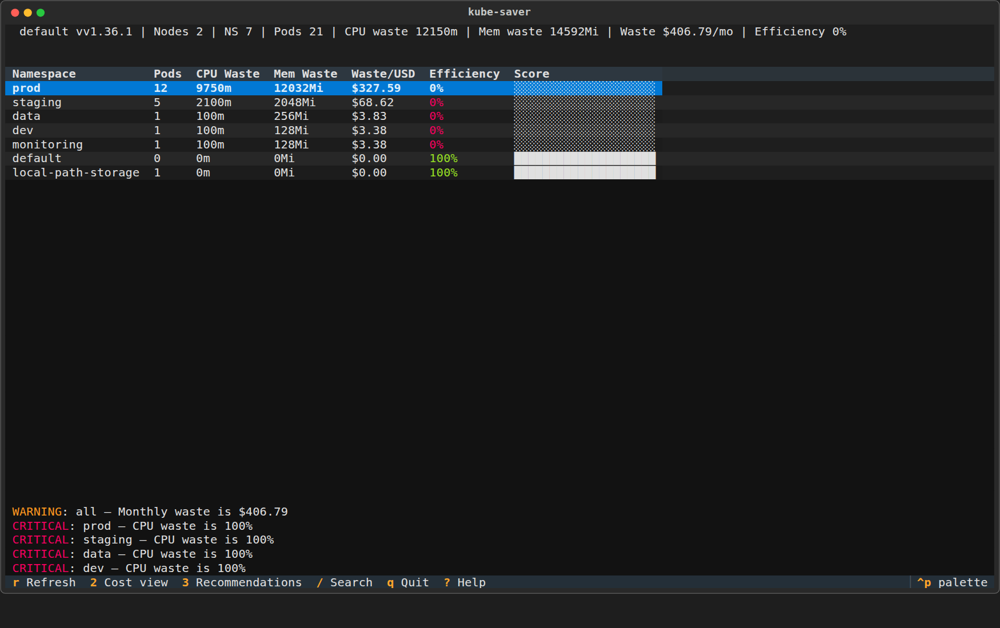
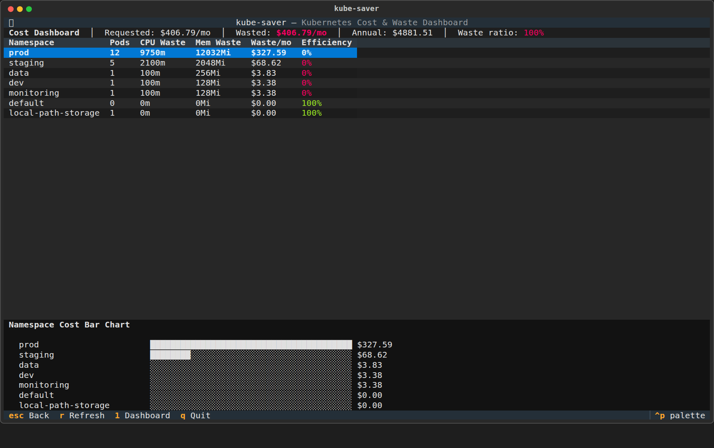
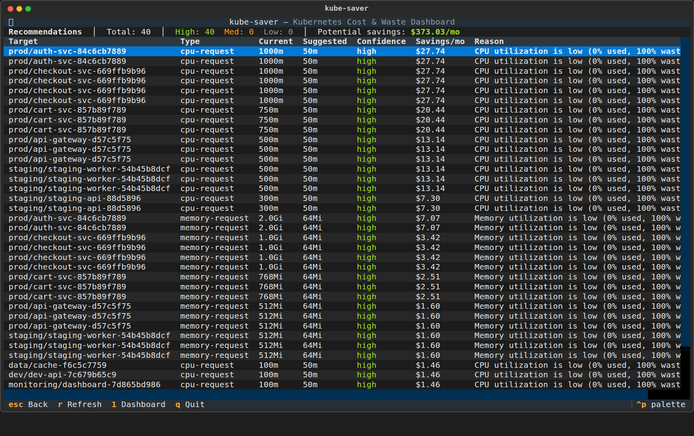

# kube-saver: Kubernetes cost estimation and resource right-sizing

Estimate Kubernetes CPU and memory costs from resource requests, metrics-server
usage, and configured pricing rates. Inspect a terminal dashboard, generate a
self-contained HTML report, or write a local resource-change plan for review.
Live scans need Kubernetes API access; generated reports can be opened offline.
No hosted kube-saver account or service is required.

[](LICENSE)
[](https://www.python.org/downloads/)
[](https://kubernetes.io/)

---

## What you get

```
┌─ kube-saver ─────────────────────────────────────────────────────┐
│ Total Monthly Waste: $406.79 │ Efficiency: 0% │ Pods: 21         │
├──────────────────────────────────────────────────────────────────┤
│ Namespace    CPU Waste   Mem Waste   Monthly $                   │
│ prod         9750m       12032Mi     $327.59                     │
│ staging      2100m        2048Mi      $68.62                     │
│ data           90m         256Mi       $3.83                     │
│ dev           100m         128Mi       $3.38                     │
│ monitoring     50m         128Mi       $3.38                     │
└──────────────────────────────────────────────────────────────────┘
```

Illustrative display only: a 0% efficiency value with estimated telemetry does not prove that workloads are idle.

- **Modeled CPU and memory costs** for namespaces, workloads, and pods
- **Interactive TUI**, k9s-style keyboard navigation, cost and recommendation views
- **Self-contained HTML report**, inline assets and no CDN; review before sharing
- **Local resource-change plans**, review files and patch commands; no GitHub PR is opened
- **Markdown spike alerts**, daily summaries written to local files, no webhook needed
- **Measured usage or estimated fallback**: metrics-server samples → request-based estimates

Cost figures are projections from configured rates and a point-in-time scan. Without metrics-server, request-based figures are upper bounds; they do not trigger right-sizing recommendations or spike alerts. They are not cloud invoices or guaranteed bill savings. See the [cost model and FAQ](docs/faq.md).

---

## Screenshots

<p align="center">
  
</p>
<p align="center"><em>Namespace overview, wastes, pods, and monthly cost at a glance.</em></p>

<p align="center">
  
</p>
<p align="center"><em>Per-namespace cost breakdown with CPU and memory waste.</em></p>

<p align="center">
  
</p>
<p align="center"><em>Candidate right-sizing recommendations with modeled savings per workload; review against representative load.</em></p>

---

## Quick start

PyPI package availability is not verified: its `kube-saver` endpoint returned
HTTP 404 on 2026-10-09 UTC. This example installs the reviewed 2.0.0 source
commit instead. See [release assets](https://github.com/pooyanazad/kube-saver/releases)
for wheel installation when available.

Requires Python 3.10+, Git for the pinned source install below, and read access to a Kubernetes cluster. Install metrics-server for measured usage and right-sizing candidates.

```bash
python3 -m venv .venv
source .venv/bin/activate
python -m pip install "git+https://github.com/pooyanazad/kube-saver.git@b2f0fdfc54fb13621c602373b7a5b91a8d483c3f"
kube-saver doctor
```

```bash
# Interactive TUI, opens immediately
kube-saver

# Self-contained HTML report
kube-saver report -o cost-report.html --json cost-report.json
# Open cost-report.html in your browser

# Local PR plan with review and apply files
kube-saver pr-plan -d ./pr-files
```

See the [full getting started guide](docs/getting-started.md) for kind, EKS, Docker Desktop, and generic kubeconfig.

---

## Interpreting results

Recommendations use current metrics samples, not historical peaks. They skip
estimated samples and multi-container pods. Smaller resource requests may free
cluster capacity without changing your cloud bill. Review candidate changes
against workload bursts, scheduling, and service objectives before applying them.

`pr-plan` writes files locally. Running its generated `kubectl patch` script
changes the cluster; it does not update GitOps manifests or open a GitHub PR.
See [safety and trust](docs/safety.md) for the current recommendation boundaries.

## Where kube-saver fits

kube-saver focuses on local cost estimates and portable review files. For ongoing
cost allocation, historical sizing, or automatic resource updates, compare the
workflows in the [comparison guide](docs/comparison.md).

---

## Who this is for

- **Platform engineers** who need to know where compute budget is leaking
- **DevOps / SRE teams** who have to communicate cost without a cloud dashboard
- **Startup teams** running Kubernetes on a tight budget
- **Solo cluster operators** who want one fast, scriptable tool

**Who this is NOT for:**
Teams that need live automated right-sizing (use VPA), billing-data ingestion (use a full cloud cost platform), or a hosted SaaS.

---

## How it stays independent

kube-saver has **no required hosted service or account**:

- HTML reports are fully self-contained (inline CSS, no CDN, works offline)
- Notifications are written to local Markdown files
- PR plans are local review/apply files; executing patches requires Kubernetes API access
- The HTTP API is loopback-only by default
- Build, test, and release workflows run through GitHub Actions

Live scans require cluster connectivity, Python dependencies, and valid credentials. Kubeconfig credential plugins may contact identity providers. Review reports for internal cluster names before sharing them.

---

## Documentation

| Document | What's inside |
|---|---|
| [Documentation index](docs/README.md) | Browse all guides by task |
| [Cost model and FAQ](docs/faq.md) | Pricing formula, telemetry, limitations |
| [Getting started](docs/getting-started.md) | First-run guide for kind, EKS, Docker Desktop, generic kubeconfig |
| [CLI reference](docs/cli-reference.md) | Every command, flag, JSON helper, server mode |
| [Configuration](docs/configuration.md) | Currency, modeled pricing, configuration and env vars |
| [Architecture](docs/architecture.md) | Module map, data flow, runtime source chain |
| [Comparison](docs/comparison.md) | Workflow comparison with k9s, Goldilocks, VPA, OpenCost |
| [Safety & trust](docs/safety.md) | What kube-saver will never do, RBAC, recommendation boundaries |
| [Self-contained outputs](docs/self-contained.md) | Why no hosted service, output guarantees |
| [Troubleshooting](docs/troubleshooting.md) | Common issues and fixes |

---

## Contributing

Contributions are welcome. See [CONTRIBUTING.md](CONTRIBUTING.md) for workflow.

```bash
git clone https://github.com/pooyanazad/kube-saver.git
cd kube-saver
python3 -m venv .venv
source .venv/bin/activate
python -m pip install -e ".[dev]"
git checkout -b my-change
pytest tests -q
ruff check src tests
mypy src
```

## License

MIT, see [LICENSE](LICENSE).
